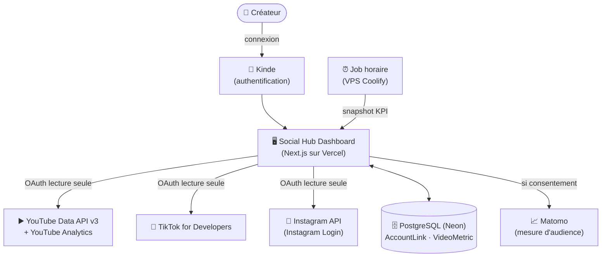

<div align="center">

[🏠 Sommaire](README.md) ·
[🌍 Présentation](01-presentation.md) ·
[⚙️ Fonctionnement](02-fonctionnement.md) ·
[🏗️ Architecture](03-architecture.md) ·
[🔒 Sécurité & vie privée](04-securite-vie-privee.md) ·
[🔌 Intégrations API](05-integrations-api.md) ·
[🗺️ Vision & roadmap](06-vision-roadmap.md) ·
[❓ FAQ](07-faq.md)

</div>

---

# 🏗️ Architecture


Cette page est technique. Si tu es juste curieux du produit, la [présentation](01-presentation.md) et le [fonctionnement](02-fonctionnement.md) suffisent largement.

## Stack

| Couche | Techno |
|---|---|
| Framework | [Next.js](https://nextjs.org) (App Router) |
| Langage | TypeScript (strict) |
| UI | React, Tailwind CSS, Recharts (graphiques) |
| Authentification app | [Kinde](https://kinde.com) |
| Base de données | PostgreSQL managé ([Neon](https://neon.tech), région UE) |
| ORM | Prisma |
| Hébergement de l'application | [Vercel](https://vercel.com) |
| Hébergement du job horaire et de Matomo | VPS Debian chez **Hostinger**, orchestré par [Coolify](https://coolify.io) |
| Mesure d'audience | Matomo auto-hébergé (chargé seulement après consentement) |

## Flux de données



## Ce que fait chaque brique

- **Kinde** : gère l'inscription/connexion à Social Hub Dashboard. L'app ne stocke jamais de mot de passe.
- **AccountLink** (table) : le lien chiffré entre un utilisateur Social Hub Dashboard et son compte YouTube/TikTok/Instagram (jeton d'accès chiffré AES-256-GCM, identifiant externe).
- **VideoMetric** (table) : une ligne par vidéo et par heure de relevé (`platform`, `videoId`, `snapshotAt`, `views`, `likes`, `comments`, `shares`) — c'est l'historique qui alimente les graphiques.
- **Job horaire** : appelle une route interne sécurisée (`/api/cron/snapshot`) qui va chercher les KPI actuels de chaque plateforme et les enregistre. Il n'est **pas** déclenché par Vercel : `vercel.json` ne déclare aucun cron, c'est le crontab d'un VPS séparé (Hostinger, orchestré par Coolify) qui appelle l'URL toutes les heures avec `CRON_SECRET`. Ce VPS héberge aussi l'instance Matomo (`stats.social-hub.fr`).
- **Middleware (`proxy.ts`)** : pose une Content-Security-Policy stricte sur chaque page, vérifie la permission `read:dashboard` (Kinde) sur les pages protégées (`/dashboard`, `/analytics`, `/settings/linked-accounts`), et applique un **refus par défaut à toute route sous `/api/`** — n'y échappent que les chemins qui portent leur propre authentification (handler Kinde, flux OAuth, `CRON_SECRET` du snapshot, signature HMAC de Meta).

## Structure du dépôt (simplifiée)

```text
app/
  dashboard/            tableau de bord (liste des vidéos, tri)
  analytics/[videoId]/  page de statistiques par vidéo (graphiques)
  settings/linked-accounts/   connecter/déconnecter les comptes
  privacy/ terms/ delete-data/   pages légales (FR/EN)
  api/
    videos/             agrège YouTube + TikTok + Instagram en direct
    oauth/<provider>/   flux de connexion par plateforme
    cron/snapshot/      relevé horaire des métriques
    analytics/[videoId]/  séries temporelles pour les graphiques
components/
  dashboard/            cartes vidéo, tri, grille
  consent/              bandeau cookies RGPD
lib/
  fetchVideos.ts        appel YouTube Data API
  tiktok/ meta/          clients API TikTok / Instagram
  accountLinks.ts        chiffrement des jetons (AES-256-GCM)
prisma/
  schema.prisma          modèle de données
proxy.ts                 middleware Next.js (auth + sécurité)
```

## Pourquoi ces choix

- **Next.js + Vercel** : déploiement continu simple, App Router pour mélanger pages serveur et client selon le besoin (le dashboard est client pour le tri interactif, les pages légales sont serveur pour le rendu SEO).
- **Neon (PostgreSQL managé, UE)** : base de données sans serveur à gérer, hébergée en Europe pour la conformité RGPD.
- **Kinde plutôt qu'un système d'auth maison** : évite de réinventer la gestion de mots de passe, sessions, réinitialisation — un vrai risque de sécurité si mal fait soi-même.
- **Pas de cache long sur les données des plateformes** : le dashboard reflète toujours l'état réel de YouTube/TikTok/Instagram au moment de la consultation, au prix d'un appel API à chaque chargement.

---

<div align="center">

⬅️ [Fonctionnement](02-fonctionnement.md) · ➡️ [Sécurité & vie privée](04-securite-vie-privee.md)

</div>
